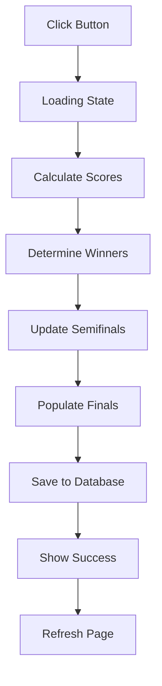

# Quick Start Guide: Arrange Elimination Winners

## 🎯 What This Feature Does

Automatically determines winners from semifinal matches and advances them to the finals based on their total scores.

## 📍 Where to Find It

**Location:** Standings Page (`/standing`)  
**Button:** Top right corner, above the team podium

## 🚀 How to Use (Step by Step)

### Step 1: Complete Prerequisites
```
✅ Round-robin season finished
✅ Elimination bracket created (top 4 teams advance)
✅ Both semifinal matches played
✅ Scores entered for both semifinals
```

### Step 2: Navigate to Standings
- Go to `/standing` page
- You'll see the team standings table

### Step 3: Click the Button
- Look for the purple gradient button at the top
- Button text: "Arrange Elimination Winners"
- Icon: Trophy 🏆

### Step 4: Wait for Processing
- Button changes to "Arranging Winners..."
- Shows loading spinner
- Usually takes 1-3 seconds

### Step 5: View Results
- Success popup appears
- Shows:
  - Number of winners (usually 2)
  - Team names
  - Total scores for each winner

### Step 6: Automatic Refresh
- Page automatically refreshes after 1 second
- Finals match now shows the two winners
- Ready to schedule the championship game!

## 💡 Example

### Before Clicking Button:

**Semifinal 1:**
- Lakers: 125 points total
- Celtics: 115 points total
- Winner: TBA

**Semifinal 2:**
- Warriors: 128 points total
- Bulls: 125 points total
- Winner: TBA

**Finals:**
- Team 1: (empty)
- Team 2: (empty)

### After Clicking Button:

**Semifinal 1:**
- Lakers: 125 points total
- Celtics: 115 points total
- Winner: **Lakers** ✓

**Semifinal 2:**
- Warriors: 128 points total
- Bulls: 125 points total
- Winner: **Warriors** ✓

**Finals:**
- Team 1: **Lakers**
- Team 2: **Warriors**

**Popup Message:**
```
🎉 Winners Arranged!

2 semifinal winners have been advanced to the final match.

Advancing to Finals:
• Lakers (125 points)
• Warriors (128 points)
```

## ⚠️ Common Issues

### Issue: Button Doesn't Appear
**Solution:** Check that you're on the `/standing` page

### Issue: Error: "No elimination match schedule found"
**Solution:** Create the elimination bracket first

### Issue: Error: "No semifinal round found"
**Solution:** Ensure semifinals exist in the bracket

### Issue: Error: "No winner determined"
**Solution:** Make sure semifinal scores are entered (not 0-0)

## 🎨 Button States

| State | Appearance | Action |
|-------|----------|--------|
| **Ready** | Purple gradient with trophy icon | Clickable |
| **Loading** | Spinner animation | Disabled |
| **Success** | Green checkmark | Disabled |
| **Error** | Returns to ready state | Clickable |

## 🔢 How Scores Are Calculated

```
Total Score = Regular Score + Match Score

Example:
Team A: 85 (regular) + 40 (match) = 125 total
Team B: 80 (regular) + 35 (match) = 115 total

Winner: Team A (125 > 115)
```

## ✅ Success Indicators

You know it worked when:
1. ✅ Success popup appears
2. ✅ Page refreshes automatically
3. ✅ Semifinal matches show winner IDs
4. ✅ Finals match shows both team names
5. ✅ Button shows "Winners Arranged!"

## 🔄 What Happens Behind the Scenes



## 🎓 Pro Tips

1. **Check Scores First** - Verify all semifinal scores are correct before arranging
2. **One Time Use** - Button only needs to be clicked once
3. **Auto Refresh** - No need to manually refresh the page
4. **Error Recovery** - If there's an error, fix the issue and try again
5. **Verify Finals** - After arranging, check the finals bracket to confirm

## 📱 Mobile vs Desktop

### Desktop
- Button appears on the right side
- Podium displays side by side
- Full table visible

### Mobile
- Button takes full width
- Podium stacks vertically
- Table scrolls horizontally

## 🆘 Need Help?

If something goes wrong:
1. Check browser console for errors
2. Verify all prerequisites are met
3. Ensure scores are entered correctly
4. Try refreshing the page
5. Contact system administrator if issue persists

## 🎊 You're All Set!

That's it! The feature is designed to be simple and intuitive. Just one click and your tournament bracket is updated automatically.

Happy tournament management! 🏀
